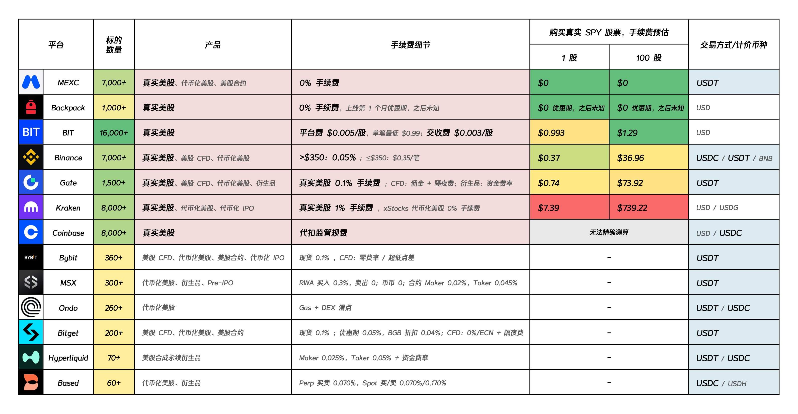

# 券商与银行对比

这一章聚焦作者正在使用和持续跟踪的 BIT + Wise 路径。传统银行、美国大型券商和香港银行仍会作为账户类型出现，但不列具体链接；这些渠道限制变化较快，读者可自行前往 YouTube 等平台搜索最新教程。

## BIT 与 Wise 对比

| 维度 | BIT | Wise |
| --- | --- | --- |
| 类型 | 特色美股/RWA 平台 | 多币种中转账户 |
| 主要用途 | 直投美股、配置全球资产、稳定币出入金 | 换汇、转账、部分本地收付款 |
| 适合人群 | 熟悉平台生态、能接受稳定币路径的人 | 需要桥接银行、平台和跨币种转账的人 |
| 主要优势 | 支持稳定币出入金，平台主打 7*24 小时处理，实际到账以平台结果为准 | 使用灵活，费用透明度较高 |
| 主要短板 | 监管、托管、出金能力都要重点核验 | 风控严格，不宜长期放大额 |
| 注册入口 | [注册](https://bit.bshareweb.com/newRegister/cn?invite_code=ZPWKMH) | [注册](https://wise.com/invite/ilpc/7klcgbf) |

BIT 的注册、KYC、USDT 入金和证券账户划转步骤见 [BIT 开户与 USDT 入金教程](08-BIT开户入金教程.md)。

## 加密美股平台横向对比

下图是加密行业美股/RWA 平台的横向对比，维度包括标的数量、产品类型、手续费、购买 SPY 股票的成本估算和计价币种。图中可以看到，BIT 在标的数量、真实美股支持、USD 计价和小额买入成本上都比较突出，适合作为本文重点介绍的直投美股平台之一。

图表为第三方整理，平台费用、标的数量和可用地区可能变化，实际交易前仍应以平台页面展示为准。

## 券商核验清单

| 检查项 | 为什么 |
| --- | --- |
| 注册实体 | 同一品牌可能有不同地区实体，信息交换和监管差异很大 |
| 监管登记 | 美国券商应能查到 SEC/FINRA 等登记信息 |
| SIPC 或托管保护 | 判断客户资产与平台自有资产是否隔离 |
| 清算安排 | 小平台尤其要看交易和资产最终托管在哪里 |
| 入金和出金规则 | 资金路径比交易界面更重要 |
| 关户/转仓机制 | 被要求补材料或退出时，资产是否能平稳转走 |

## 资金账户类型对比

| 类型 | 用处 | 风险点 |
| --- | --- | --- |
| 香港银行 | 常见跨境汇款节点，离内地近，资料准备相对熟悉 | CRS 年度摘要、开户收紧、券商出入金风控 |
| 美国银行 | ACH 方便，适合长期美元使用 | 开户门槛高，远程账户对异常资金敏感 |
| 跨地区银行体系 | 已有高净值客户可打通中港美账户 | 资产门槛、地区口径、客户经理执行差异 |
| Wise | 补足换汇、转账和部分本地收付款能力 | 英国参与 CRS，账户冻结和资金来源审查严格 |

## 选择建议

| 情况 | 建议 |
| --- | --- |
| 只有港卡 | 可以研究传统券商电汇路径，也可以用 Wise 做小额试转 |
| 有美国银行账户 | 优先研究 ACH 绑定和出金规则 |
| 无港卡无美卡 | Wise 可作为小额试转通道，但不要当成唯一主路径 |
| 交易频率不高 | 优先选规则清晰、导出报表方便的平台 |
| 资产规模较大 | 先做税务、继承和银行关系规划，再决定平台 |

## 成本项目

| 成本 | 常见位置 |
| --- | --- |
| 汇率点差 | 人民币换港币、美元或其他币种 |
| 电汇费 | 汇出行、中转行、收款行 |
| 中转账户手续费 | 换汇、提现、本地转账 |
| 券商费用 | 交易佣金、期权合约费、平台费、退汇处理费 |
| 银行维护成本 | 月费、最低余额、账户降级 |
