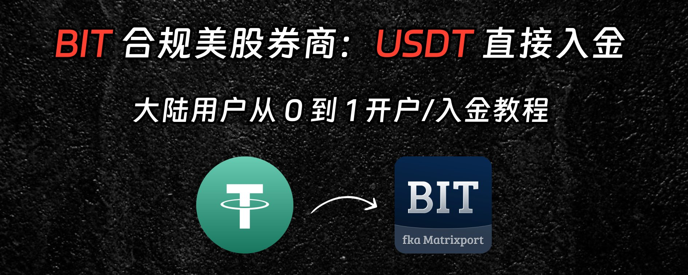
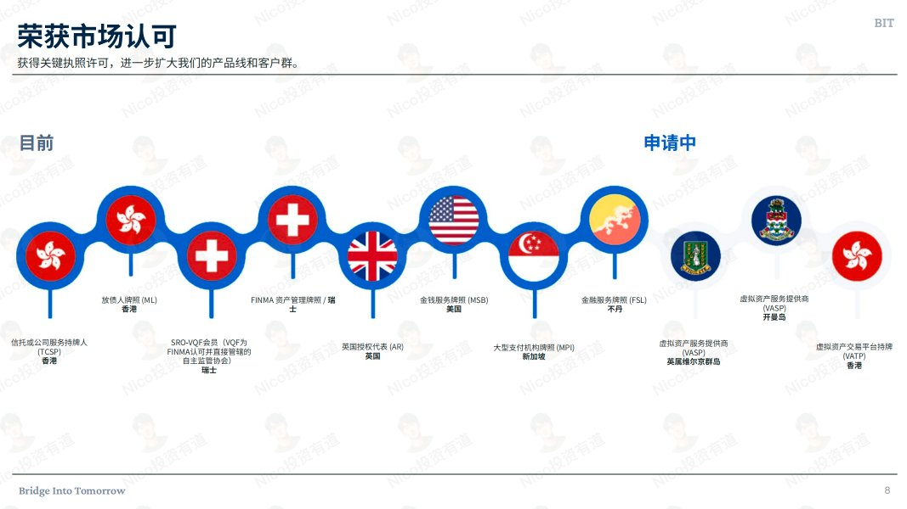
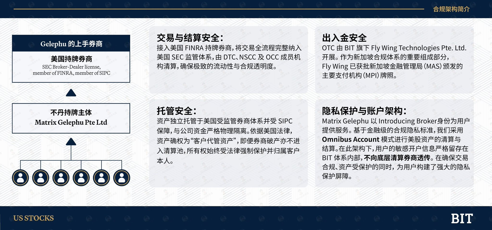
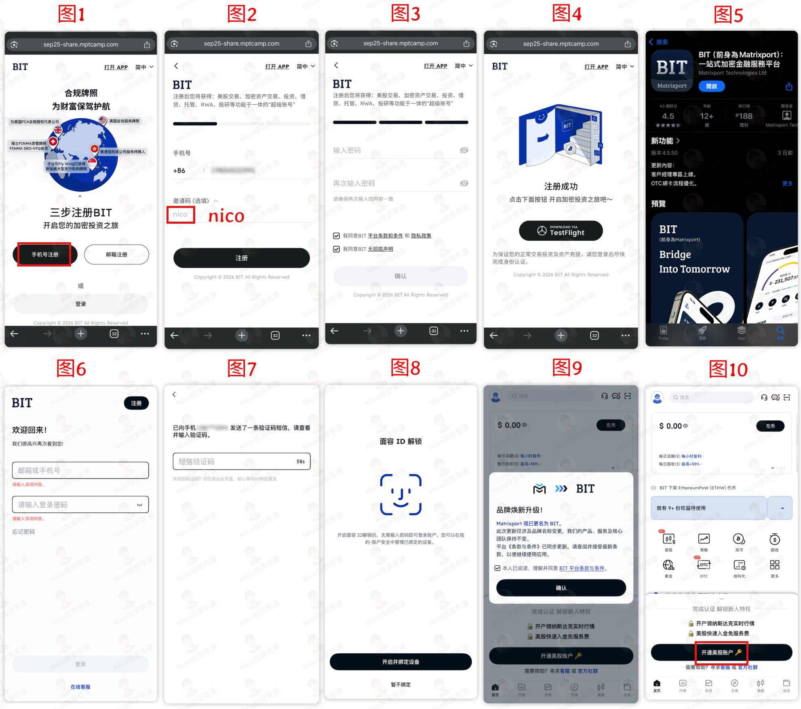
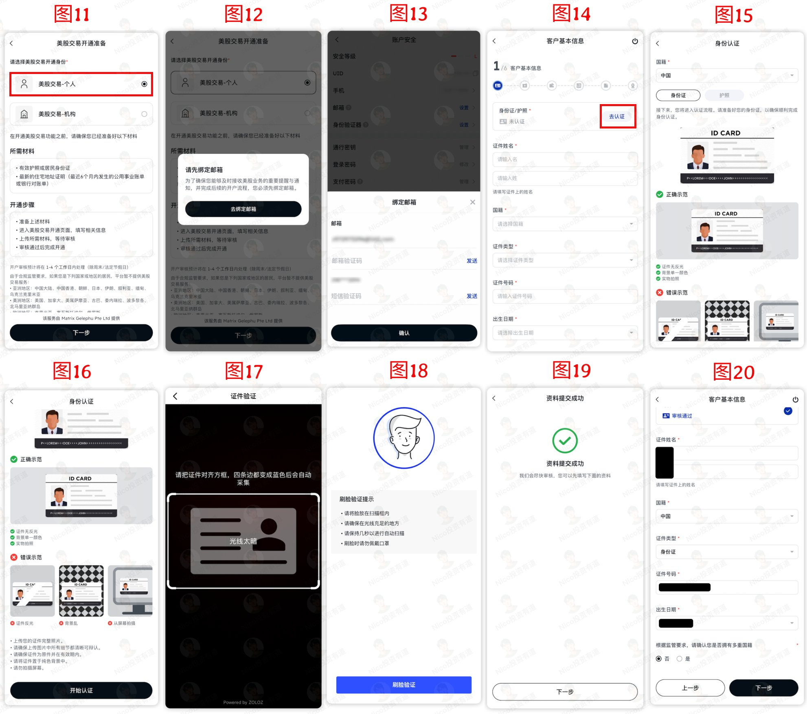
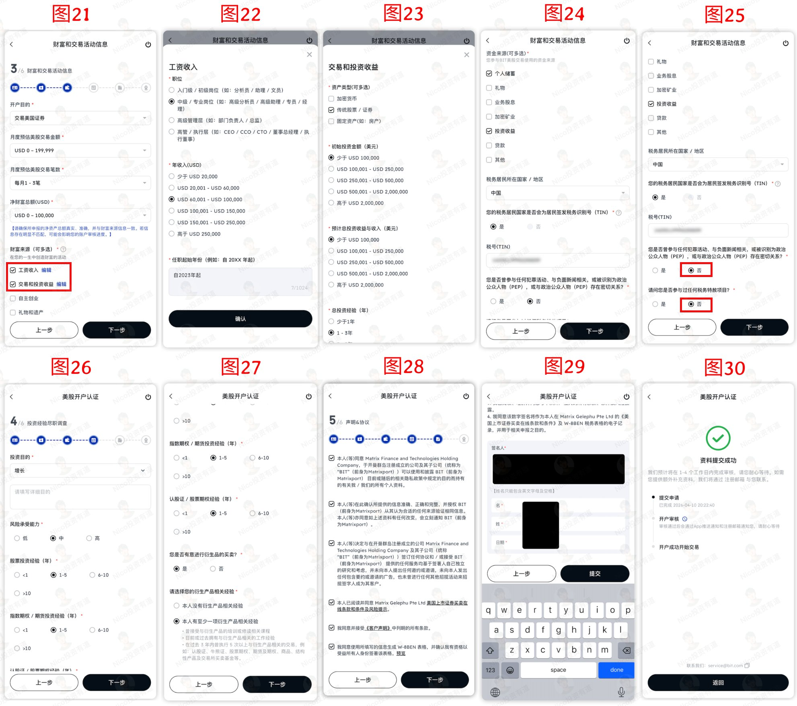
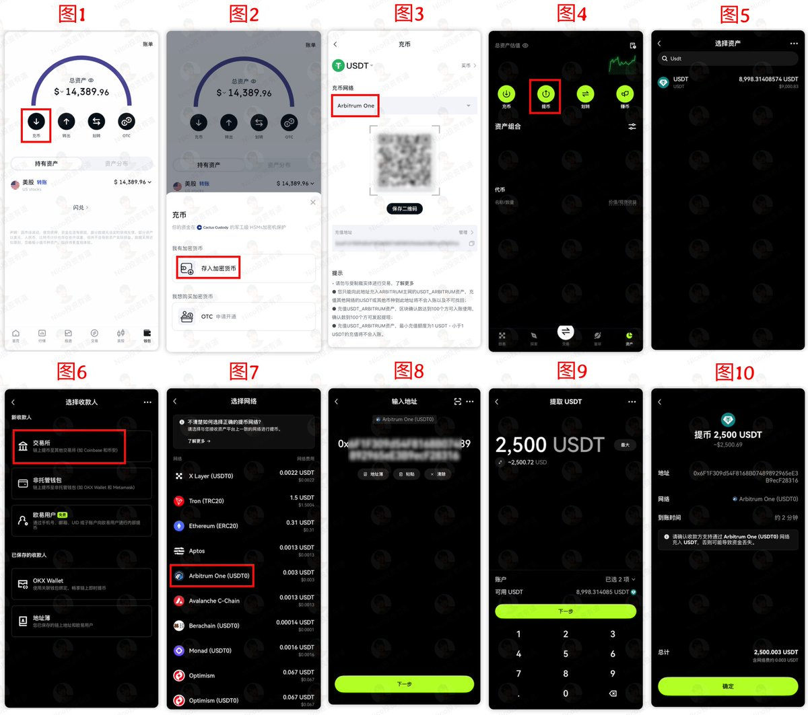
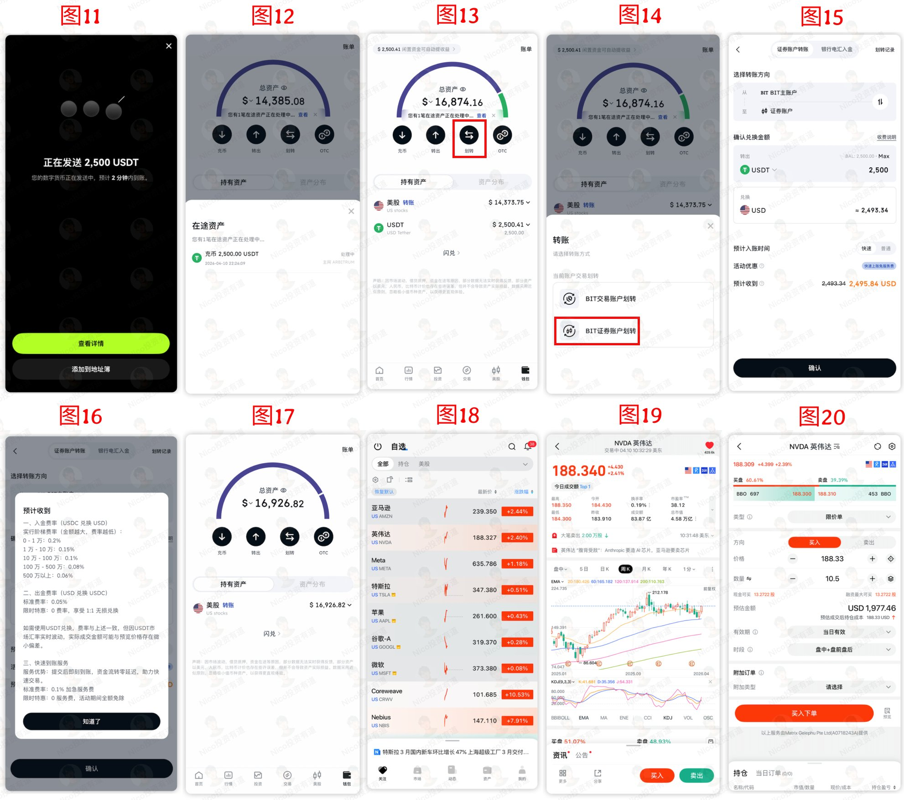

# BIT 开户与 USDT 入金教程

本章介绍 BIT 的开户、KYC、美股账户开通和 USDT 入金流程。BIT 的优势在于不依赖传统境外银行账户，可以通过稳定币完成入金，再划转到证券账户用于美股交易。所有费用、活动和可用地区都可能变化，实际操作前以 App 页面显示为准。

注册链接：[BIT 注册](https://bit.bshareweb.com/newRegister/cn?invite_code=ZPWKMH)

## 为什么选择 BIT

传统美股券商通常需要更完整的海外资料，例如海外地址证明、境外银行账户、更多资金来源说明等。对没有港卡、美卡或海外地址的人来说，第一步就可能卡住。

BIT 的思路不同：它把美股交易能力接入到数字资产金融平台中，用户可以用身份证或护照完成 KYC，并通过 USDT/USDC 等稳定币路径入金。对已经持有稳定币、希望减少传统银行链路的人来说，这条路更直接。

需要区分的是，BIT 的美股功能并不是简单的“美股代币”。根据平台披露，其美股业务通过持牌实体与美国持牌上手券商连接，交易、清算和托管由受监管券商体系承接。用户仍应自行复核平台披露、监管实体、托管安排和客户资产保护规则。

## 合规与托管结构

BIT 前身为 Matrixport，后更名为 Bridge Into Tomorrow。平台披露了多地金融牌照和监管申请信息，美股业务则通过相关持牌主体连接美国清算托管券商。

从交易链路看，可以理解成三段：

| 层级 | 作用 |
| --- | --- |
| 美国上手券商 | 负责美股交易执行、清算和托管 |
| BIT 相关持牌主体 | 作为介绍经纪商或服务主体，承接用户账户和交易指令 |
| 用户账户 | 提交 KYC、入金、下单和持仓 |

这个结构的关键是资产隔离和托管安排。真正开户前，建议重点看平台披露的清算券商、客户资产托管、SIPC 适用范围、出金规则和关户转出机制。

## 开户前准备

| 项目 | 建议 |
| --- | --- |
| 身份证件 | 准备身份证或护照，证件照片要清晰 |
| 邮箱和手机号 | 用长期可用的邮箱和手机号 |
| App 环境 | 可能需要外区 App Store 或 Google Play 下载 BIT |
| 稳定币 | 入金前先准备少量 USDT/USDC 做测试 |
| 链上网络 | 提前确认 BIT 与转出平台支持的同一条网络 |

第一次操作不要大额入金。先用小金额测试地址、网络、到账速度和划转流程，确认无误后再扩大金额。

## 注册与登录

1. 打开 [BIT 注册](https://bit.bshareweb.com/newRegister/cn?invite_code=ZPWKMH)。
2. 使用手机号或邮箱注册，设置登录密码。
3. 下载并打开 BIT App，使用刚才的账号登录。
4. 按提示完成短信或邮箱验证码。
5. 如果 App 提示品牌升级或账户确认，按页面完成确认。
6. 在首页或底部导航找到“美股”或“开通美股账户”入口。

## 身份认证与美股账户开通

进入美股账户开通流程后，通常会先选择账户类型。普通个人用户选择个人账户即可。

后续认证大致包括：

1. 绑定邮箱。
2. 选择国籍或税务居民信息。
3. 选择身份证或护照进行身份认证。
4. 扫描证件正反面。
5. 完成人脸识别。
6. 核对系统识别出的姓名、证件号、出生日期等信息。

地址材料按 App 页面要求提交。部分情况下，国内身份证或近期开具的国内银行卡账单也可能用于证明地址；如果页面要求更具体的材料，应以平台最新要求为准。

接下来会填写一组投资和财务问卷。建议如实填写：

| 项目 | 填写方向 |
| --- | --- |
| 开户目的 | 交易美国证券或资产配置 |
| 预计交易额和笔数 | 按自己的真实计划填写 |
| 净资产和收入 | 不夸大、不随意编造 |
| 资金来源 | 工资收入、个人储蓄、投资收益等真实来源 |
| 税号 | 中国居民通常填写身份证号 |
| 投资经验 | 按实际股票、基金、加密或衍生品经验填写 |

最后确认协议，使用英文拼音签名并提交。审核时间可能随平台排队和材料情况变化，常见情况是一个工作日左右完成。

## USDT 入金

账户审核通过后，可以通过链上转账向 BIT 充值稳定币，再划转到证券账户。

基础流程：

1. 打开 BIT App，进入钱包。
2. 选择充币或存入加密货币。
3. 选择币种，例如 USDT。
4. 选择网络，例如 Arbitrum。具体网络以 App 页面显示为准。
5. 复制 BIT 充值地址。
6. 从自己的交易所或钱包发起提现，币种和网络必须完全一致。
7. 小额测试到账后，再进行正式入金。

网络选择非常重要。BIT 端选择什么网络，转出平台就必须选择同一网络。链选错可能导致资产无法找回。

## 划转到证券账户

稳定币到账后，还需要从钱包划转到证券账户，并转换为美股交易可用的美元余额。

常见步骤：

1. 在 BIT 钱包中查看充值到账。
2. 点击划转。
3. 选择划转到证券账户。
4. 将 USDT/USDC 按页面汇率和费用转换为 USD。
5. 确认证券账户出现可用美元余额。
6. 进入美股交易页，开始查看个股、ETF 或碎股交易。

## 费用关注点

BIT 的费用可能随活动、金额、品种和地区变化。操作前建议至少核对以下项目：

| 项目 | 说明 |
| --- | --- |
| 稳定币入金费 | 可能按阶梯费率收取，金额越大费率可能越低 |
| 快速到账服务费 | 活动期可能减免，非活动期以页面显示为准 |
| 平台费 | 美股交易可能按股数收取，每笔有最低费用 |
| 卖出相关费用 | 交易活动费、监管费等通常在卖出时体现 |
| 链上提现费 | 从交易所或钱包转出稳定币时产生 |

不要只看“到账快”。更重要的是确认总磨损、到账路径、可出金方式和平台活动是否仍有效。

## 风险检查

- 先小额测试，再扩大金额。
- 只使用自己能解释来源的稳定币。
- 充值网络、地址、币种必须逐项核对。
- KYC 信息、税务居民身份和资金来源应如实填写。
- 保留注册、KYC、充币、划转、交易、出金记录。
- 平台规则、手续费、准入地区可能调整，长期使用要定期复查。

